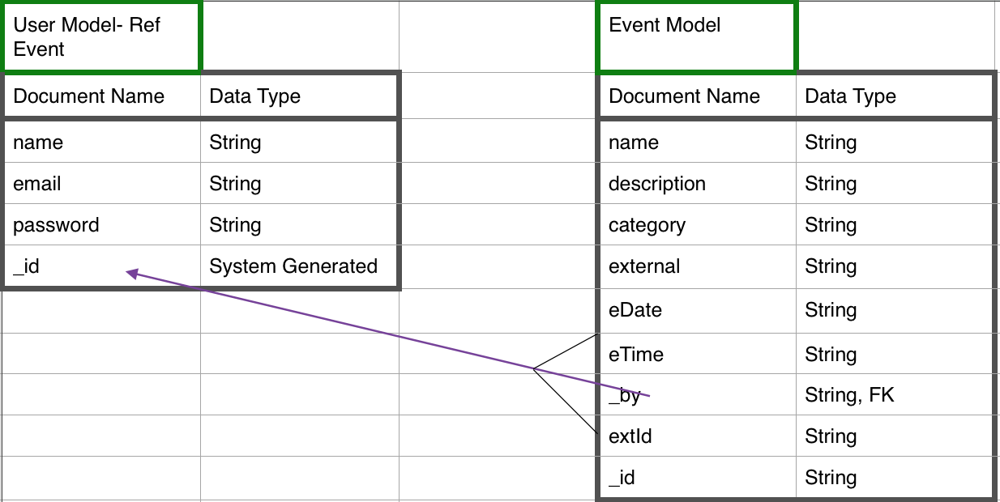

#Event Hub
### A simple way to map your event life.

#### The purpose of the App is to give the user a way to centralize all his/her events. These events are either created by the user or added to his/her hub through a third party API.

##Content
* Installation & Requirements
* Usage
* Data Structure & Site Layout
* User Stories
* Technologies
* Troubleshooting & Additional Functionality
* Contributing
* Credits

## Installation & Requirements
* Download the entire contents and open with your code editor.
* Need to have NPM and node installed on your local machine.
* Browsers: chrome, opera, firefox, safari, IE8 and above.
* You will need to add your own Api key for each API.
* Data base is linke to heroku so you will have to change the db connection string to your local machine

## Usage
You can use the app for your own purposes. However, you will have to acquire your own API credentials for all the available API's. Furthermore, you will need to reconfigure the app to be hosted in your localhost vs heroku.

## Data Structure & Site Layout
The site has user model and events model

## User Stories

A user decides to track their todo's in an event format

1. A user decides to track their todo's in an event format
2. User creates an account and goes to their profile page
3. They click on a menu option to add an event and gets redirected to the add event page
4. Once they submit their event they can see their event in their profile page
5. The event can be viewed on its own or within a monthly, weekly or daily view (??)
6. User can edit their profile and change their personal information

A user decides they want to see events that are from an API

1. The user will go to the list of all available API's
2. They will then be able to go to a search page for that API
3. From the search page they will be able to find what they are looking for and then go see the specific information
4. They will then be able to add the event to their list of events

## Technologies
* Node.js, bcrypt-nodejs, body-parser, connect-flash, cookie-parser, dotenv,
  ejs, express, express-ejs-layouts, express-session,  mongoose,
  morgan, passport, passport-facebook, passport-local, socket.io
* Database: mongodb hosted on heroku
* Styling: HTML, CSS(Saas, Less), Bootsrap,
* Site Hosting:  Heroku

## Troubleshooting & Pending Functionality
* Currently we only have one API. We will add more API's in time
* We would like the user to share their events with friends
* People comenting on events that they have visited
* There are minor bugs that need fixing

## Contributing
1. Fork it and make it your own
2. Make suggestions for improvements and or enhancements

## Credits

Credit to our Instructors and TA's for all their help and guidance.

#### Instructors & Assistants

| Name               |                   GitHub                  | Role
| ------------------ |   :--------------------------------------: | ------------ |
| Jimmy Garzon       |   [jimbog](https://github.com/jimbog)    | Teacher |
| Philippe Luchansky |  [philuchansky](https://github.com/philuchansky) | Teacher |
| Sean Pypers  |   [seapyp](https://github.com/seapyp)    |  Assistant |
| Conrad Sze   |   [conradsze](https://github.com/conradsze) |  Assistant |
